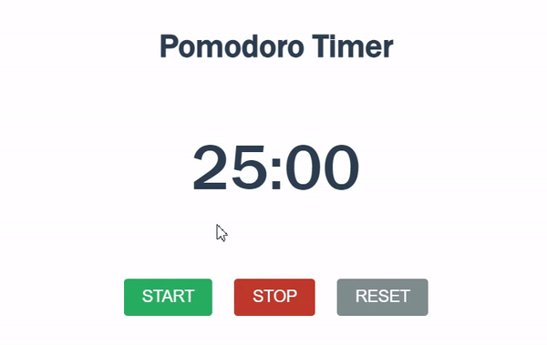

# Pomodoro-Timer


<br>

## 기능 
25분 동안 집중할 수 있도록 하는 타이머

<br>

## 학습 
### 1. JS : padStart()
<u>현재 문자열의 시작을 다른 문자열로 채워, 주어진 길이를 만족하는 새로운 문자열을 반환</u>합니다. 채워넣기는 대상 문자열의 시작(좌측)부터 적용됩니다.  

```
const str1 = '5';

console.log(str1.padStart(2, '0'));  // Expected output: "05"

const fullNumber = '2034399002125581';
const last4Digits = fullNumber.slice(-4);  // 5581
const maskedNumber = last4Digits.padStart(fullNumber.length, '*');

console.log(maskedNumber);  // Expected output: "************5581"
```

<br>

### 2. JS : clearInterval()  
이전에 호출로 설정된 시간 제한이 있는 <u>반복 작업을 취소</u>  

예 ) 500밀리초마다 한 번씩 두 가지 배경색 간을 전환
```
const myInterval = setInterval(setColor, 500);

function setColor() {
  let x = document.body;
  x.style.backgroundColor = x.style.backgroundColor == "yellow" ? "pink" : "yellow";
}

function stopColor() {
  clearInterval(myInterval);
}
```


<br>

## 학습 출처
**유튜브**  

**CSS**  

**JS**  
 
**키워드**  
- padStart